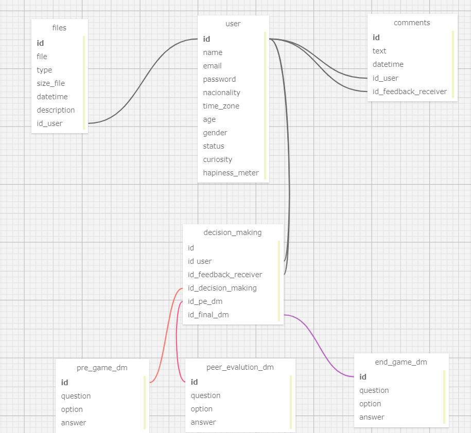

# Modelo Relacional de Banco de Dados - Ponderada de Programação Semana 3
Um modelo relacional de banco de dados é um método de estruturar e organizar dados em tabelas chamadas relações, que são formalmente conhecidas como tabelas no contexto de bancos de dados. Este modelo foi proposto por Edgar F. Codd em 1970 e desde então tornou-se o padrão dominante para bancos de dados.
### Características Principais
1. Tabelas: Os dados são armazenados em tabelas, onde cada tabela representa um tipo de entidade ou objeto. Por exemplo, uma tabela de Usuários pode conter informações sobre os usuários de um sistema.
2. Linhas e Colunas: Cada tabela é composta por linhas e colunas. Cada linha (também chamada de registro ou tupla) representa um item ou instância única dentro da tabela, enquanto cada coluna (ou campo) representa um tipo de dado que a tabela está programada para armazenar, como nome ou endereço de email.
3. Chave Primária: Cada tabela geralmente possui uma chave primária, que é um campo ou uma combinação de campos que identificam exclusivamente cada linha na tabela. Por exemplo, um ID de Usuário pode servir como chave primária na tabela de usuários.
4. Chave Estrangeira: As tabelas são frequentemente relacionadas umas às outras por meio de chaves estrangeiras. Uma chave estrangeira é um campo em uma tabela que está vinculado à chave primária de outra tabela, estabelecendo assim uma relação entre as duas tabelas.
5. Integridade de Dados: O modelo relacional impõe a integridade de dados através de regras e restrições para garantir que os dados armazenados sejam precisos e consistentes. Isso inclui integridade de entidade, referencial, e outras formas de restrições como as de domínio.
### Vantagens
- Facilidade de Uso: A representação tabular dos dados é intuitiva e facilita a manipulação e consulta dos dados usando uma linguagem de consulta estruturada (SQL).
- Flexibilidade: Os modelos relacionais podem se adaptar facilmente a mudanças nos requisitos de informação.
- Normalização: Os dados são armazenados de forma que as redundâncias são minimizadas, através de um processo chamado normalização.
### Utilização
O modelo relacional é usado em uma ampla variedade de aplicações, desde sistemas simples de gestão de informações até complexos sistemas comerciais e financeiros. A sua natureza flexível e robusta torna-o ideal para a maioria das necessidades de armazenamento de dados.

    

### Entidades e Atributos
1. User: Representa os jogadores ou usuários da aplicação. Atributos incluem informações básicas como nome, email, senha, nacionalidade, fuso horário, idade, gênero, e também alguns atributos menos comuns como "curiosity" e "happiness_meter", que podem ser usados para adaptar a experiência do jogo ao estado emocional ou curiosidade do usuário.
2. Files: Associada aos usuários, esta tabela parece armazenar arquivos que os usuários podem subir para o sistema, incluindo o tipo, tamanho e descrição do arquivo, além de uma marcação de tempo.
3. Comments: Permite aos usuários comentar sobre alguma atividade ou conteúdo dentro do jogo. A tabela armazena o texto do comentário, a data e hora, e relaciona cada comentário a um usuário e a um receptor do feedback.
4. Decision_Making: Esta tabela é particularmente central para a aplicação, indicando que ela tem um forte componente de tomada de decisão. Parece haver um processo de decisão inicial e final, além de um feedback associado.
5. Pre_Game_DM, Peer_Evaluation_DM, e End_Game_DM: Estas tabelas estão ligadas ao processo de decisão em diferentes fases do jogo (pré-jogo, avaliação por pares e pós-jogo). Cada tabela contém perguntas, opções disponíveis e respostas selecionadas, facilitando a dinâmica interativa e decisória no jogo.

### Relações

- Relação entre User e Files/Comments: Cada arquivo ou comentário está claramente ligado a um usuário específico, indicando quem o carregou ou quem escreveu o comentário.
- Relações de Decisão: As várias tabelas de decisão (Pre_Game_DM, Peer_Evaluation_DM, End_Game_DM) parecem estar fortemente interligadas, sugerindo uma sequência de etapas ou eventos onde as decisões dos usuários são coletadas e avaliadas ao longo do jogo.
